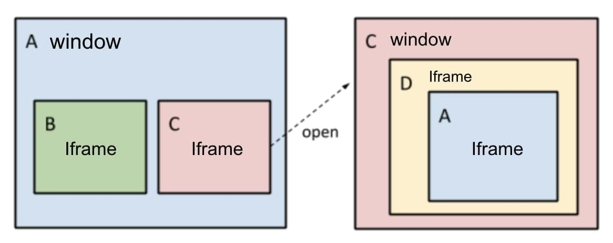

Chrome process models experiment
================================

Add to hosts file the following hosts:

```
127.0.0.1	a.test
127.0.0.1	b.test
127.0.0.1	c.test
127.0.0.1	d.test
```

Run http servers
```
(cd ./a.test && python3 -m http.server 8001) &
(cd ./b.test && python3 -m http.server 8002) &
(cd ./c.test && python3 -m http.server 8003) &
(cd ./d.test && python3 -m http.server 8004)
```

Open `http://a.test:8001/frame.html` and click on link then you will get to following window hierarchy:

```
tab: a.test
 - iframe: b.test
 - iframe: c.test

tab: c.test
  - iframe: d.test
       - iframe: a.test
```



Run Google Chrome with [specified flag](https://www.chromium.org/developers/design-documents/process-models#Supported_Models) then open task manager to check processes


Experiments:

* http://a.test/frame.html
* http://a.test/frame-link.html
